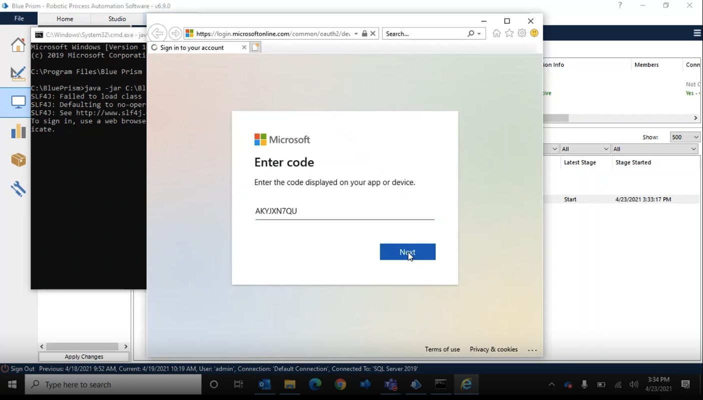
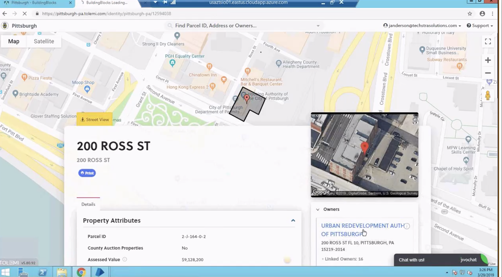

# Robotic Process Automation

A combination of Blue Prism, Windows bash terminal commands and Java together, can automate tedious repetitive daily operations. This repository holds public demo videos which showcase the power of robotic process automation and how it can automate tedious, repetitive and mundane tasks which humans would find boring to complete on a daily basis for an extended period of time.

These RPA solutions were dpeloyed to virtual machines hosted in MS Azure. I later further automated the deployment process using Powershell scripts.

# Meeting Prep Tool

## Blue Prism + Java + Bash

Using Blue Prism, I built an RPA process which used Java REST APIs to access an employee's Outlook calendar to then lookup each attendee on LinkedIn and download their public LinkedIn  profile as a PDF file. It would add each attendee to a queue, then scrape information relevant to the meeting attendee such as the target audience's current location, job title and educationl background. The purpose of this automated process was to help sales executives prepare for their meetings (especially, large ones with 10+ other corporate attendees). After an attendee's information was fetched, the attendee would be removed from the queue and their information would be marked as "processed".

Use Case: For example, prior to a sales call the sales representative would like to learn more about the educational and professional background of his or her audience and this tool would fetch the information for them automatically first thing in the morning and then they can review it in one place (Outlook email summary with LinkedIn profile links and public resumes attached).

### Demo Video

Here's a demo video of the automated RPA business process in action:

[Watch the video here](demo-videos/Meeting%20Prep%20Blue%20Prism.mp4)

Demo Image Thumbnail:

# Public Sector Process Automation

## Variance Report Generation

Using Blue Prism, I build another RPA process which could navigate to URA websites daily using the Chrome web browser and then download property assessment reports. It would then compare the latest report with previously downloaded reports and look for any changes in assessed property value. If there were variances that qualified for tax exemptions, it automatically completed a Tax Exemption form and emailed it to the concerned official via the employee's Outlook account. If there were no concerned variances found, it continued looking through other properties in the queue.

### Demo Video

Here's a demo video of the automated RPA government process in action:

[Watch the video here](demo-videos/URA%20Demo.mp4)

Demo Image Thumbnail:

 

_Disclaimer: The code for these projects is propreitary. Hence, I have not disclosed it here. However, the demo videos I have uploaded were already uploaded to other public platforms like LinkedIn so I have added them here as part of my personal portfolio._